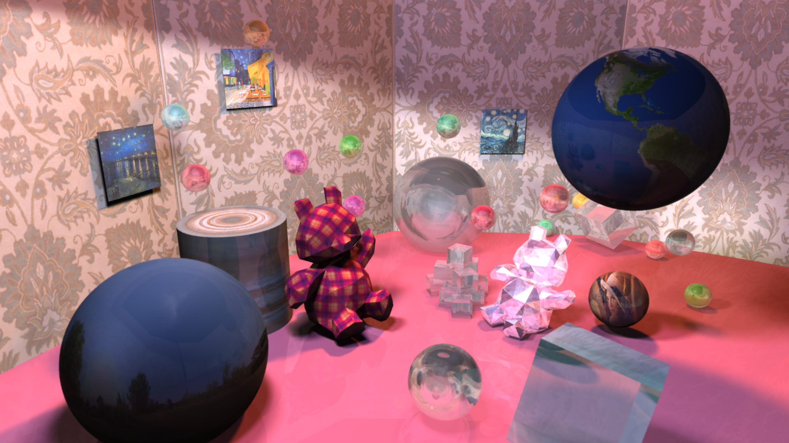

# STD-Raytracer

A multi-threaded ray-traced/path-traced renderer built from scratch with the C++ standard library and [nlohmann/json](https://github.com/nlohmann/json).

[](https://github.com/Trenza1ore/std-raytracer/actions/workflows/test.yml)

This project was originally created for the **Computer Graphics: Rendering** coursework at the University of Edinburgh in 2023, with small bug fixes added after submission.

The renderer reads scene descriptions from JSON files, renders either ray-traced or path-traced images, and writes PPM output. It has been tested on Windows 11, Ubuntu, and macOS.



https://github.com/user-attachments/assets/fb152ac1-2d47-4b62-9231-f097cd12511b

## Quick Start

Build the renderer from the `Code/` directory:

```bash
cd Code
make
```

Run an example scene:

```bash
cd ../bin
./RunRaytracer -p simple_phong
```

Some scenes, especially path-traced scenes, take significantly longer to render.

## Usage

```text
RunRaytracer [-r render_dir] [-s scene_dir] [-f frame_start] [-m frame_max] [-t step] [-p|-d|-q] [scene_name]
```

| Option | Meaning |
|---|---|
| `-r render_dir` | Directory to save rendered output. Defaults to `../TestSuite/`. |
| `-s scene_dir` | Directory to load scenes from. Defaults to `../Resources/`. |
| `-f frame_start` | Starting frame index. Defaults to `0`. |
| `-m frame_max` | Maximum number of frames to render. Defaults to unlimited. |
| `-t step` | Frame step. Defaults to `1`. |
| `-p` | Preview: override render settings with preview options. |
| `-d` | Decent: override render settings with ray-tracer options. |
| `-q` | Quality: override render settings with path-tracer options. |
| `scene_name` | Scene name without file extension. Defaults to `scene_anim`. |

Example:

```bash
./RunRaytracer -p simple_phong
```

## Features

### Ray tracing

- Recursive ray tracing with Phong/Blinn-Phong-style shading
- Ambient, point, and area lights
- Shadows
- Reflection
- Refraction
- Binary render mode

### Path tracing

- Monte Carlo path tracing
- Multi-bounce light transport
- Antialiasing / camera sampling
- Aperture sampling
- Area light sampling

### Materials

- Blinn-Phong materials
- Physically based material workflow using roughness, metallic, and Fresnel terms
- Diffuse and specular colour controls
- Reflective and refractive materials
- Texture-mapped materials

### Geometry and acceleration

- BVH acceleration structure
- Triangles
- Spheres and UV spheres
- Cylinders and UV cylinders
- ASCII PLY meshes
- Cube maps
- Spherical environment maps

### Rendering pipeline

- Multithreaded renderer
- Linear HDR framebuffer
- Exposure control
- Tone mapping
- Gamma correction
- PPM image writing

### Scene and tooling support

- JSON scene format
- Animation via external JSON files
- Blender animation exporter script
- PPM textures
- ASCII PLY meshes

## Repository Layout

| Path | Purpose |
|---|---|
| `Code/` | Renderer source code and `Makefile` |
| `Resources/` | Scene JSON files, animation JSON files, textures, and meshes |
| `TestSuite/` | Example renders and default render output directory |
| `TestOutput/` | Test output placeholder directory |
| `TestScripts/` | Helper scripts for building and rendering tests |
| `FeatureList.txt` | Original coursework feature checklist |
| `Usage.txt` | Command-line usage reference |

The executable is expected to be run from `bin/` after building.

## File Formats

- **Scenes:** JSON. Scene files can reference separate animation JSON files.
- **Textures:** PPM, P6 binary format.
- **Models:** PLY, ASCII 1.0 plain text. Texturing supports Blender's S-H coordinates and a custom format used by this project.

## Renderer Architecture

```text
Scene JSON
    |
    v
Scene parser
    |
    v
Camera / lights / materials / geometry
    |
    v
BVH construction
    |
    v
Ray tracer / path tracer
    |
    v
Linear HDR framebuffer
    |
    v
Exposure -> tone mapping -> gamma correction
    |
    v
PPM output
```

<details>
<summary><strong>Scene JSON Reference</strong></summary>

## Top-level keys

```json
{
  "camera": { },
  "scene": {
    "backgroundcolor": [],
    "shapes": [],
    "lightsources": []
  },
  "rendermode": "preview|phong|pathtracer|binary",
  "nbounces": 5,
  "frames": 1,
  "shadow samples": 1,
  "camera samples": 1,
  "animation path": "animation.json"
}
```

## Camera

Required fields:

- `type`
- `width`
- `height`
- `fov`
- `position`
- `lookAt`
- `upVector`

Optional fields include:

- `exposure`
- `gamma`
- `diameter`
- `Lw`

## Lights

Supported light types:

- `ambient`
- `pointlight`
- `arealight`

Point lights and area lights can define attenuation coefficients:

- `kc`
- `kl`
- `kq`

Area lights accept either a 2D size:

```json
"size": [width, depth]
```

or a 3D size:

```json
"size": [width, height, depth]
```

## Shapes

Implemented shape types:

- `triangle`
- `sphere`
- `uvsphere`
- `cylinder`
- `uvcylinder`
- `ply`
- `cubemap`
- `sphericalmap`

Common required fields:

| Shape | Required fields |
|---|---|
| `triangle` | `v0`, `v1`, `v2` |
| `sphere` | `center`, `radius` |
| `cylinder` | `center`, `radius`, `height`, `axis` |
| `ply` | `path`, `offset`, `scale` |

Optional fields used by some shapes include:

- `uv0`
- `uv1`
- `uv2`
- `alias`
- `euler`
- `texturescale`

## Materials

Observed material fields:

- `ka`
- `kd`
- `ks`
- `diffusecolor`
- `specularcolor`
- `specularexponent`
- `reflectivity`
- `isreflective`
- `isrefractive`
- `refractiveindex`
- `roughness`
- `metallic`
- `transmittance`
- `texturepath`

Implementation details:

- `roughness >= 0` enables the BRDF path.
- Roughness is squared internally for GGX-style parameterization.
- Metallic materials use a Disney-style metallic workflow.
- Fresnel reflectance uses Schlick approximation.

## Animation

A scene can reference an external animation file:

```json
"animation path": "animscene.json"
```

Objects may define an `alias`; animation data can target aliases instead of autogenerated object IDs.

</details>

<details>
<summary><strong>Implementation Notes</strong></summary>

## Acceleration

The renderer constructs a BVH automatically. Every primitive provides a bounding box and participates in acceleration.

## Texture Mapping

Supported texture mappings include:

- UV sphere mapping
- UV cylinder mapping
- UV triangle mapping
- Cube maps
- Spherical environment maps

Textures are loaded as floating-point RGB values. Current texture support is for PPM files.

## Lighting

Area lights precompute a sample cache and reuse it during rendering to reduce runtime random-number generation.

## Colour Pipeline

Rendering is performed in linear colour space. Before output, the renderer applies:

1. Exposure
2. Tone mapping
3. Gamma correction

</details>

<details>
<summary><strong>Example Blender script for exporting animation data</strong></summary>

The script below exports key-framed object position/rotation data for use with the animation JSON format. It cannot guarantee correct output for every Blender scene.

```python
import bpy
from numpy import degrees # can be replaced with math module

# Note: this only extract key-framed animations
# 1. bake all simulations
# 2. select the objects to bake
# 3. in Object menu at top-left, select [Object > Rigid Body > Bake to Keyframes]
# 4. now, run this script

# This brings up console for debug:
# bpy.ops.wm.console_toggle()

# name of objects to exclude
exclude = ["0", "836"]

# path to save the json
file = open("path\\to\\your\\animscene.json", 'w')

# load scene, objects and frame numbers
scene = bpy.context.scene
frame_num = scene.frame_end - scene.frame_start + 1
objects = [o for o in bpy.context.scene.objects if o.name not in exclude]

file.write("{\n\t\"frames\" : %d,\n\t\"animated objects\" : %d,\n\t\"animations\" : [\n"%(frame_num, len(objects)))
template = "\t\t\t{\n\t\t\t\"pos\":[%.9f, %.9f, %.9f],\n\t\t\t\"rot\":[%.9f, %.9f, %.9f]\n\t\t\t},\n"
content = ""
for obj in objects:
    object_animation = "\t{\n\t\t\"id\" : \"%s\",\n\t\t\"transform\" : [\n"%obj.name
    animated_frames = ""
    for frame in range(scene.frame_start, scene.frame_end+1):
        scene.frame_set(frame)
        loc = obj.location
        rot = degrees(obj.rotation_euler)
        # print(frame, loc)
        animated_frames += template%(loc.x, loc.y, loc.z, rot[0], rot[1], rot[2])
    object_animation += (animated_frames[:-2] + "\n\t\t]\n\t},\n")
    content += object_animation
file.write(content[:-2] + "\n\t]\n}\n")
file.close()
```

</details>
